# Chatbot Bantuan Hukum Masyarakat Awam Berbasis RAG, LangChain, dan LangGraph

## Deskripsi Proyek

Proyek ini merupakan implementasi chatbot bantuan hukum yang dikembangkan untuk membantu masyarakat memperoleh informasi hukum secara lebih mudah dan cepat. Sistem menggunakan pendekatan Retrieval-Augmented Generation (RAG), sehingga jawaban yang dihasilkan tidak hanya berasal dari kemampuan model bahasa, tetapi juga didukung oleh dokumen hukum yang telah diproses sebelumnya.

Pada proyek ini digunakan dua sumber dokumen hukum, yaitu Undang-Undang Ketenagakerjaan dan Undang-Undang Perlindungan Konsumen. Pengguna dapat mengajukan pertanyaan menggunakan bahasa alami, kemudian sistem akan mencari bagian dokumen yang paling relevan sebelum menghasilkan jawaban.

Pengembangan sistem memanfaatkan LangChain sebagai framework RAG, LangGraph untuk mengatur alur kerja chatbot, ChromaDB sebagai vector database, serta LangSmith untuk monitoring dan evaluasi pipeline.

---

## Identitas Mahasiswa

| Keterangan | Isi |
|------------|------|
| Nama | Ferdinand Tobing |
| NPM | 233510397 |
| Mata Kuliah | Natural Language Processing |
| Platform | Google Colab |

---

## Latar Belakang

Informasi hukum sering kali sulit dipahami oleh masyarakat karena menggunakan istilah dan bahasa yang formal. Di sisi lain, tidak semua orang memiliki akses untuk berkonsultasi langsung dengan praktisi hukum ketika menghadapi suatu permasalahan.

Melalui proyek ini dibangun sebuah chatbot yang dapat membantu pengguna memperoleh informasi awal mengenai hak dan kewajiban mereka berdasarkan dokumen hukum yang tersedia. Sistem tidak ditujukan untuk menggantikan konsultasi hukum profesional, melainkan sebagai sarana penyedia informasi yang lebih mudah diakses.

---

## Tujuan

Tujuan dari pengembangan proyek ini adalah:

- Menerapkan konsep Retrieval-Augmented Generation (RAG).
- Mengintegrasikan LangChain dan LangGraph dalam sistem chatbot.
- Memanfaatkan vector database untuk pencarian dokumen berbasis semantic search.
- Menghasilkan jawaban yang didukung oleh sumber dokumen hukum yang relevan.
- Melakukan monitoring dan evaluasi proses menggunakan LangSmith.

---

## Dokumen Hukum yang Digunakan

| Dokumen | Topik Utama |
|----------|------------|
| UU No. 13 Tahun 2003 tentang Ketenagakerjaan | PHK, pesangon, kontrak kerja, hak pekerja |
| UU No. 8 Tahun 1999 tentang Perlindungan Konsumen | Garansi, refund, hak konsumen, tanggung jawab pelaku usaha |

---

## Arsitektur Sistem

```text
Pengguna
    │
    ▼
Pertanyaan Hukum
    │
    ▼
Clarify Context
    │
    ▼
Retrieve Documents
    │
    ▼
Analyze and Answer
    │
    ▼
Jawaban Akhir
```

Workflow chatbot dibangun menggunakan LangGraph yang terdiri dari beberapa node utama. Setiap node memiliki tugas yang berbeda mulai dari memahami pertanyaan, mencari dokumen yang relevan, hingga menghasilkan jawaban berdasarkan konteks yang ditemukan.

---

## Teknologi yang Digunakan

| Teknologi | Fungsi |
|------------|---------|
| Python | Bahasa pemrograman utama |
| LangChain | Framework Retrieval-Augmented Generation |
| LangGraph | Workflow dan state management |
| ChromaDB | Penyimpanan embedding dokumen |
| OpenAI | Model bahasa untuk menghasilkan jawaban |
| LangSmith | Monitoring dan evaluasi pipeline |
| Pandas | Pengolahan data |
| Matplotlib | Visualisasi data |
| PyPDF | Membaca dokumen PDF |

---

# Implementasi Sistem

## Halaman Utama Proyek

Notebook diawali dengan penjelasan proyek, latar belakang, library yang digunakan, serta dokumen hukum yang menjadi sumber pengetahuan chatbot.

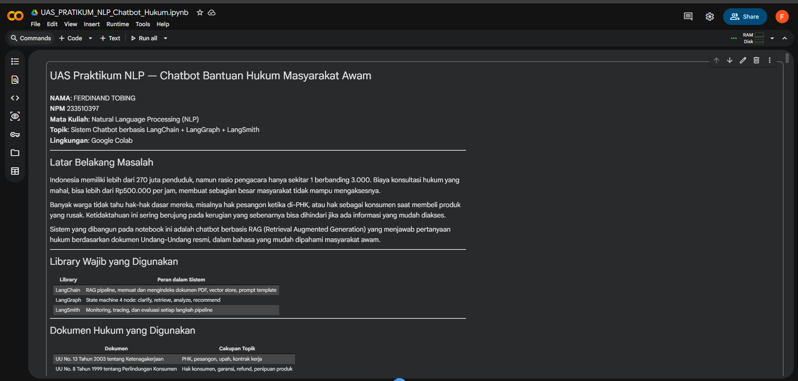

---

## Upload dan Verifikasi Dokumen

Sistem melakukan upload dan verifikasi dokumen hukum sebelum diproses lebih lanjut.

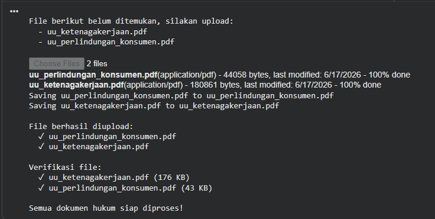

---

## Pembentukan Vector Store

Dokumen hukum dipecah menjadi beberapa bagian (chunk), kemudian diubah menjadi embedding dan disimpan ke dalam ChromaDB.

Hasil pemrosesan menunjukkan:

| Domain | Jumlah Chunk |
|----------|-------------|
| Ketenagakerjaan | 229 |
| Konsumen | 81 |
| Total | 310 |

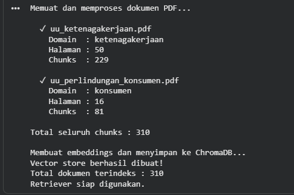

---

## Workflow LangGraph

Workflow chatbot dibangun menggunakan empat node utama yang mengatur keseluruhan proses pengambilan keputusan.

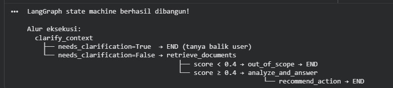

---

## Proses Retrieval Dokumen

Pada tahap ini sistem melakukan pencarian dokumen yang paling relevan berdasarkan pertanyaan pengguna. Dokumen yang ditemukan kemudian digunakan sebagai konteks untuk menghasilkan jawaban.

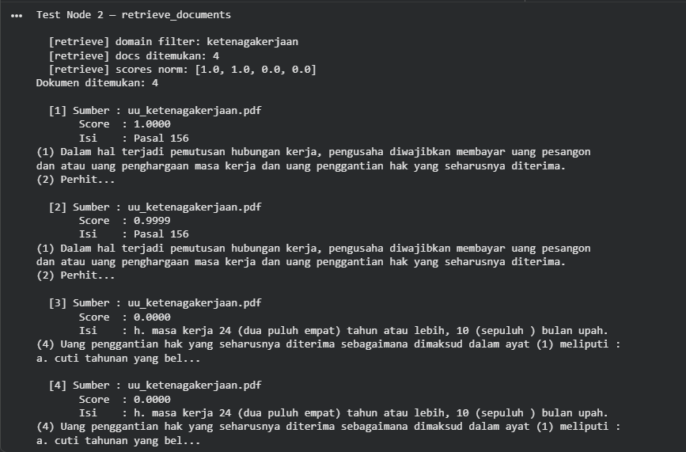

---

## Analisis dan Pembentukan Jawaban

Context yang diperoleh dari proses retrieval dikirim ke model bahasa untuk menghasilkan jawaban yang lebih mudah dipahami oleh pengguna.

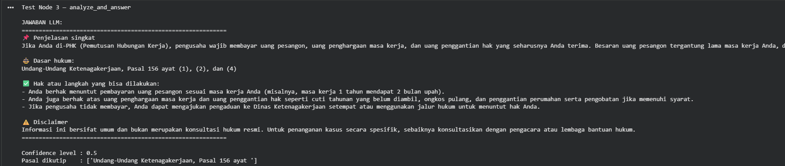

---

## Pengujian Chatbot

Pengujian dilakukan menggunakan beberapa pertanyaan dari domain ketenagakerjaan dan perlindungan konsumen.

Contoh pertanyaan yang digunakan:

- Berapa pesangon yang saya dapatkan jika di-PHK setelah bekerja 6 tahun?
- Apakah kontrak kerja lisan memiliki kekuatan hukum?
- Toko online tidak mau refund padahal produk yang dikirim rusak.
- Saya membeli barang tetapi tidak sesuai deskripsi.

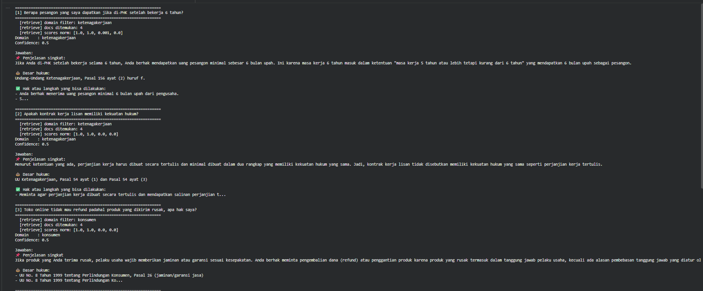

---

# Visualisasi Data

## Distribusi Chunk Dokumen

Visualisasi berikut menunjukkan jumlah chunk yang dihasilkan dari masing-masing dokumen hukum.

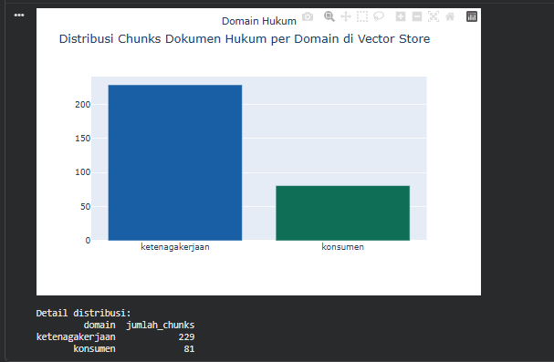

---

## Visualisasi Embedding Dokumen

Embedding dokumen divisualisasikan menggunakan Principal Component Analysis (PCA) dua dimensi untuk melihat persebaran data pada vector space.

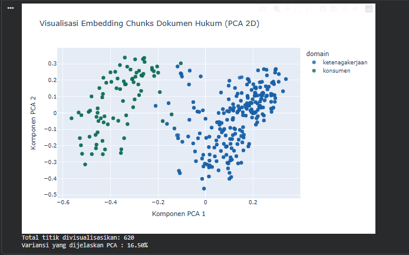

---

# Evaluasi Sistem

Evaluasi dilakukan untuk menguji kemampuan sistem dalam mengidentifikasi domain pertanyaan yang diberikan pengguna.

Hasil evaluasi menunjukkan:

| Metrik | Hasil |
|---------|---------|
| Jumlah Query Uji | 6 |
| Prediksi Benar | 6 |
| Akurasi Domain | 100% |

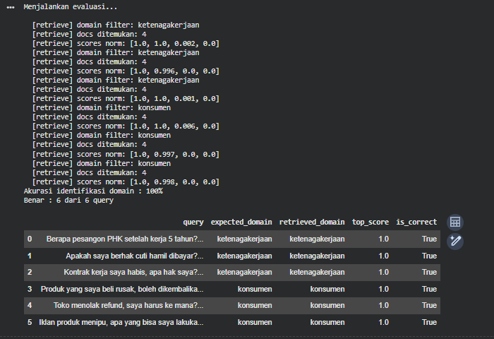

---

# Monitoring dengan LangSmith

LangSmith digunakan untuk memantau proses eksekusi setiap node, mengukur latency, serta membantu proses debugging selama pengembangan sistem.

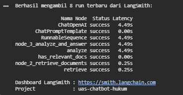

---

# Cara Menjalankan Program

## 1. Clone Repository

```bash
git clone https://github.com/USERNAME/UAS-PRATIKUM-NLP-CHATBOT-HUKUM.git
cd UAS-PRATIKUM-NLP-CHATBOT-HUKUM
```

## 2. Install Dependensi

```bash
pip install langchain
pip install langgraph
pip install chromadb
pip install openai
pip install langsmith
pip install pandas
pip install matplotlib
pip install pypdf
```

## 3. Konfigurasi API Key

```python
OPENAI_API_KEY = "YOUR_API_KEY"
LANGSMITH_API_KEY = "YOUR_API_KEY"
```

## 4. Jalankan Notebook

Buka file:

```text
UAS_PRATIKUM_NLP_Chatbot_Hukum.ipynb
```

Kemudian jalankan seluruh cell secara berurutan dari awal hingga akhir.

---

# Hasil yang Dicapai

- Berhasil mengimplementasikan Retrieval-Augmented Generation (RAG).
- Berhasil menggunakan ChromaDB sebagai vector database.
- Berhasil membangun workflow chatbot menggunakan LangGraph.
- Berhasil melakukan monitoring pipeline menggunakan LangSmith.
- Berhasil mengidentifikasi domain pertanyaan dengan akurasi 100% pada data uji yang digunakan.

---

# Kesimpulan

Berdasarkan hasil implementasi dan pengujian, chatbot bantuan hukum berhasil dibangun menggunakan pendekatan Retrieval-Augmented Generation (RAG). Integrasi LangChain, LangGraph, ChromaDB, dan OpenAI memungkinkan sistem memberikan jawaban yang relevan berdasarkan dokumen hukum yang tersedia. Selain itu, penggunaan LangSmith membantu proses evaluasi dan pemantauan kinerja sistem selama pengembangan.

---

## Referensi

1. LangChain Documentation
2. LangGraph Documentation
3. ChromaDB Documentation
4. OpenAI Documentation
5. Undang-Undang Nomor 13 Tahun 2003 tentang Ketenagakerjaan
6. Undang-Undang Nomor 8 Tahun 1999 tentang Perlindungan Konsumen
